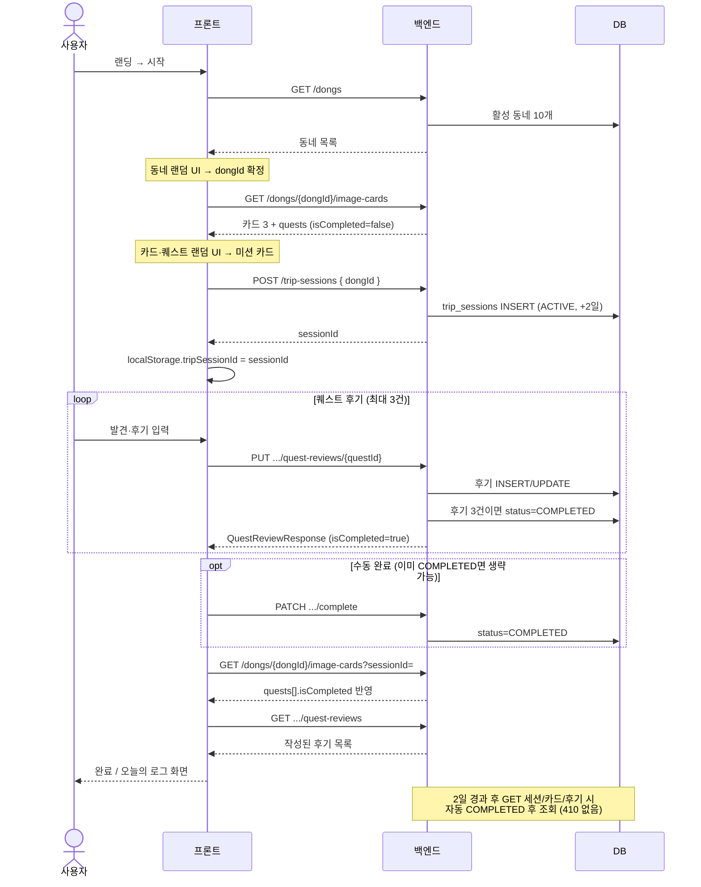

# 핀트립 백엔드 개발 가이드

로그인 없이 `sessionId(UUID)`로 여행 상태를 유지하는 MVP 백엔드 기준 문서다.  
API·플로우·DoD는 **이 문서를 기준**으로 한다.

---

## 1. 사용자 플로우

```text
GET /dongs
  → (프론트) 동네 랜덤 UI
GET /dongs/{dongId}/image-cards?sessionId=...
  → (프론트) 카드·퀘스트 랜덤 UI (quests[].isCompleted 반영)
POST /trip-sessions { dongId }
  → sessionId 발급 (localStorage 보관)
PUT /trip-sessions/{sessionId}/quest-reviews/{questId}  (퀘스트당 1회, 최대 3개)
  → 3건 작성 시 status 자동 COMPLETED
GET /trip-sessions/{sessionId}/quest-reviews
PATCH /trip-sessions/{sessionId}/complete  (수동 완료, 선택)
GET /trip-sessions/{sessionId}  (새로고침 복구, 2일 경과 시 자동 COMPLETED)
```

- 세션 **만료**: 생성 후 **2일** (`expiredAt`). 조회 시점에 만료되었으면 `status` → **COMPLETED** (자동)
- 퀘스트 후기 **3건** 저장 시 `status` → **COMPLETED** (자동)
- `quests[].isCompleted`: 해당 세션에서 후기가 작성된 퀘스트는 `true`
- 랜덤 장소/퀘스트는 **프론트**에서 처리. 백엔드는 동네별 **고정 카드 3장 + 카드별 퀘스트 3개**만 제공.

### API 시퀀스 (첫 방문 → 완료)



---

## 2. P0 API 목록

| 메서드 | 경로 | 설명 |
|--------|------|------|
| `GET` | `/dongs` | 활성 동네 10개 |
| `GET` | `/dongs/{dongId}/image-cards` | 카드 3개 + 카드별 퀘스트 3개 (`?sessionId=` 시 `isCompleted`) |
| `POST` | `/trip-sessions` | `{ "dongId": number }` → `sessionId` |
| `GET` | `/trip-sessions/{sessionId}` | 세션 복구 (`dong`, `status`) |
| `GET` | `/trip-sessions` | 동일 (헤더 `X-Session-Id`) |
| `PUT` | `/trip-sessions/{sessionId}/quest-reviews/{questId}` | 퀘스트 후기 저장/수정 |
| `GET` | `/trip-sessions/{sessionId}/quest-reviews` | 작성된 후기 목록 |
| `PATCH` | `/trip-sessions/{sessionId}/complete` | `status` → `COMPLETED` (수동; 2일 만료·후기 3건은 자동) |

프론트 연동·Vercel 설정: [프론트_API_연동_가이드.md](프론트_API_연동_가이드.md)

---

## 3. API 상세

### `GET /dongs`

응답: `id`, `name`, `active`

### `GET /dongs/{dongId}/image-cards`

쿼리: `sessionId` (선택) — 전달 시 해당 세션의 `quests[].isCompleted` 반영, 세션 상태 자동 갱신(2일·3건)

응답 예시 (카드 1개):

```json
{
  "imageCardId": 1,
  "dongId": 1,
  "imageFile": "Seongsu-Q01-Q05-Q18.jpg",
  "imageHeadline": "오래된 공장의 흔적을 따라 걷는 길",
  "imageSubDescription": "낡은 간판과 셔터 사이에서…",
  "quests": [
    {
      "questId": 1,
      "quest": "낡은 간판 찾기",
      "questDescription": "동네를 걸으며…",
      "isCompleted": false
    }
  ]
}
```

- 실제 이미지 파일은 프론트 정적 자산 (`imageFile` 파일명만 반환)

### `POST /trip-sessions`

요청: `{ "dongId": 1 }`  
응답: `sessionId`, `dongId`, `createdAt`

### `PUT /trip-sessions/{sessionId}/quest-reviews/{questId}`

- `questId` = `image_card_quests.id` (위 `quests[].questId`)
- 퀘스트당 후기 **1개** (`UNIQUE(session_id, quest_id)`), 재요청 시 **수정**

요청:

```json
{
  "imageCardId": 1,
  "discoveredNote": "오래된 간판과 조용한 골목을 발견했다",
  "reviewText": "유명한 장소는 아니지만…",
  "moodTags": ["조용했다", "다시 가고 싶다"]
}
```

- 작성: 세션 `ACTIVE` + 미만료
- `imageCardId`는 세션 동네 소속, `questId`는 해당 카드 소속인지 검증

### `GET /trip-sessions/{sessionId}/quest-reviews`

- 세션에 저장된 후기만 반환 (작성 안 한 퀘스트는 목록에 없음)

---

## 4. 도메인·DB 요약

상세 ERD: [핀트립_ERD.md](핀트립_ERD.md) · DDL/seed: [../resources/db/README.md](../resources/db/README.md)

| 테이블 | 역할 |
|--------|------|
| `dongs` | 동네 10개 |
| `dong_image_mappings` | 동네별 이미지 카드 3장 (30) |
| `image_card_quests` | 카드별 퀘스트 3개 (90) |
| `trip_sessions` | UUID 세션, `dong_id`, `status`, `expired_at` |
| `trip_session_quest_reviews` | 세션·퀘스트별 후기 |

데이터 소스 CSV: `pintrip_image_quest_mapping_with_neighborhood.csv`

---

## 5. 기술 스택·로컬 실행

- Java 17, Spring Boot 3.x, JPA, Validation, MySQL
- 로컬: Docker Compose + `application-local` 프로필

```bash
docker compose down -v   # schema/data 다시 넣을 때만
docker compose up -d
./gradlew bootRun
```

- JPA `ddl-auto: update` (로컬·prod)
- `schema.sql` / `data.sql` → Docker **최초 볼륨 생성 시**만 자동 실행

---

## 6. 에러 응답

```json
{
  "code": "SESSION_NOT_FOUND",
  "message": "sessionId를 찾을 수 없습니다."
}
```

| 코드 | HTTP | 상황 |
|------|------|------|
| `SESSION_NOT_FOUND` | 404 | 잘못된 sessionId |
| `SESSION_EXPIRED` | 410 | COMPLETED·만료 처리된 세션에 후기 쓰기 |
| `DONG_NOT_FOUND` | 404 | dongId 없음/비활성 |
| `PLACE_NOT_FOUND` | 404 | 동네에 카드 없음 |
| `QUEST_NOT_FOUND` | 404 | questId·카드 불일치 |
| `INVALID_REQUEST` | 400 | 카드가 세션 동네와 불일치 등 |

---

## 7. 패키지 구조

[백엔드_폴더_구조.md](백엔드_폴더_구조.md) 참고.

| 영역 | 패키지 |
|------|--------|
| 동네·카드 | `domain/dong`, `domain/image` |
| 세션·후기 | `domain/session` |
| 공통 | `global/config`, `global/error` |

---

## 8. 완료 기준 (DoD)

- [ ] P0 API 전체 동작 (Swagger 또는 curl)
- [ ] 프론트 플로우 1회 이상 성공
- [ ] 새로고침 후 `GET /trip-sessions/{sessionId}` 복구
- [ ] 퀘스트 후기 PUT/GET 동작
- [ ] 만료·잘못된 questId·카드 검증 시 4xx
- [ ] CORS (프론트 도메인) 정상

---

## 9. 배포

[배포_EB_체크리스트.md](배포_EB_체크리스트.md) — EB 환경 변수, RDS, `trip_session_quest_reviews` 테이블 반영

---

## 10. 기획·아키텍처 참고

- 제품 콘셉트: [핀트립_기획.md](핀트립_기획.md) (초기 기획; 서버 랜덤 API 설명은 현재 구현과 다름)
- 세션 설계 배경: [핀트립_아키텍처.md](핀트립_아키텍처.md)
