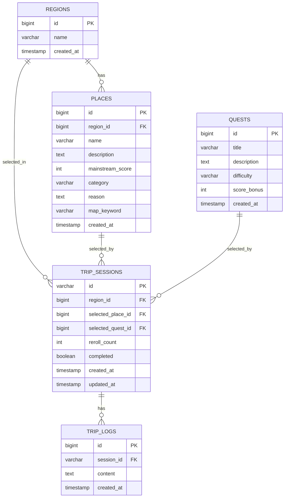

# 핀트립 MVP ERD (해커톤 1일 기준)

이 문서는 `핀트립_아키텍처.md`, `백엔드_개발_실행계획.md`를 기준으로,
당일 구현에 필요한 최소 데이터 모델을 정리한 ERD다.

---

## 1. ERD (Mermaid)



---

## 2. 테이블별 설계 포인트

### `trip_sessions`

- 핵심 집계(Aggregate) 테이블
- `id`는 UUID 문자열(36) 권장
- `selected_place_id`, `selected_quest_id`는 초기엔 `NULL` 허용
- `completed` 기본값 `false`
- `reroll_count` 기본값 `0` (P1 확장 대비)

### `trip_logs`

- 한 세션에 여러 로그가 달리는 1:N 구조
- 로그 조회 성능을 위해 `session_id, created_at` 인덱스 권장

### `places`, `quests`, `regions`

- 해커톤에서는 `data.sql` seed 기반 정적 데이터 운영
- `places.region_id`로 지역별 랜덤 추출

---

## 3. 권장 DDL (H2/PostgreSQL 공통 스타일)

```sql
CREATE TABLE regions (
    id BIGINT PRIMARY KEY,
    name VARCHAR(100) NOT NULL,
    created_at TIMESTAMP DEFAULT CURRENT_TIMESTAMP
);

CREATE TABLE places (
    id BIGINT PRIMARY KEY,
    region_id BIGINT NOT NULL,
    name VARCHAR(150) NOT NULL,
    description TEXT,
    mainstream_score INT DEFAULT 0,
    category VARCHAR(50),
    reason TEXT,
    map_keyword VARCHAR(150),
    created_at TIMESTAMP DEFAULT CURRENT_TIMESTAMP,
    CONSTRAINT fk_places_region
        FOREIGN KEY (region_id) REFERENCES regions(id)
);

CREATE TABLE quests (
    id BIGINT PRIMARY KEY,
    title VARCHAR(150) NOT NULL,
    description TEXT,
    difficulty VARCHAR(20),
    score_bonus INT DEFAULT 0,
    created_at TIMESTAMP DEFAULT CURRENT_TIMESTAMP
);

CREATE TABLE trip_sessions (
    id VARCHAR(36) PRIMARY KEY,
    region_id BIGINT,
    selected_place_id BIGINT,
    selected_quest_id BIGINT,
    reroll_count INT DEFAULT 0,
    completed BOOLEAN DEFAULT FALSE,
    created_at TIMESTAMP DEFAULT CURRENT_TIMESTAMP,
    updated_at TIMESTAMP DEFAULT CURRENT_TIMESTAMP,
    CONSTRAINT fk_trip_sessions_region
        FOREIGN KEY (region_id) REFERENCES regions(id),
    CONSTRAINT fk_trip_sessions_place
        FOREIGN KEY (selected_place_id) REFERENCES places(id),
    CONSTRAINT fk_trip_sessions_quest
        FOREIGN KEY (selected_quest_id) REFERENCES quests(id)
);

CREATE TABLE trip_logs (
    id BIGINT GENERATED BY DEFAULT AS IDENTITY PRIMARY KEY,
    session_id VARCHAR(36) NOT NULL,
    content TEXT NOT NULL,
    created_at TIMESTAMP DEFAULT CURRENT_TIMESTAMP,
    CONSTRAINT fk_trip_logs_session
        FOREIGN KEY (session_id) REFERENCES trip_sessions(id)
);

CREATE INDEX idx_places_region_id ON places(region_id);
CREATE INDEX idx_trip_logs_session_created_at ON trip_logs(session_id, created_at);
```

---

## 4. API와 ERD 매핑

- `POST /trip-sessions` -> `trip_sessions` insert
- `PATCH /trip-sessions/{sessionId}/region` -> `trip_sessions.region_id` update
- `POST /trip-sessions/{sessionId}/place/random` -> `places` 조회 후 `selected_place_id` update
- `POST /trip-sessions/{sessionId}/quest/random` -> `quests` 조회 후 `selected_quest_id` update
- `POST /trip-sessions/{sessionId}/logs` -> `trip_logs` insert
- `GET /trip-sessions/{sessionId}` -> `trip_sessions` + `regions` + `places` + `quests` + `trip_logs` join/read

---
