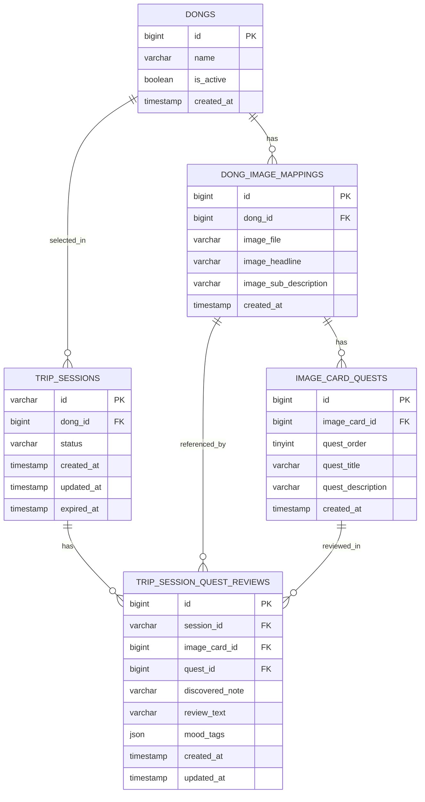

# 핀트립 MVP ERD

기준 데이터: `pintrip_image_quest_mapping_with_neighborhood.csv`  
인증 없음 · **UUID 세션** · 만료 **2일**

DDL/seed: [../resources/db/README.md](../resources/db/README.md) · API: [백엔드_개발_실행계획.md](백엔드_개발_실행계획.md)

---

## 1. ERD (Mermaid)

---

## 2. 설계 포인트

- `dongs`: 동네 목록(10개)
- `dong_image_mappings`: 동네별 카드 3개(총 30개)
- `image_card_quests`: 카드별 퀘스트 3개(총 90개, 문구+설명)
- `trip_sessions`: 기존 세션 유지 (`dong_id`, 상태/시간 정보, 만료 2일)
- `trip_session_quest_reviews`: 세션별 퀘스트 후기 (퀘스트당 1개)

---

## 3. API 매핑

| API | DB 동작 |
|-----|---------|
| `GET /dongs` | `dongs` 활성 목록 조회 |
| `POST /trip-sessions` | 세션 생성(`dong_id`) |
| `GET /dongs/{dongId}/image-cards` | 카드 3개 + 카드별 퀘스트 3개 반환 |
| `GET /trip-sessions/{sessionId}` | 세션(`dong_id`, 상태) 복구 |
| `PUT /trip-sessions/{sessionId}/quest-reviews/{questId}` | 퀘스트 후기 저장/수정 |
| `GET /trip-sessions/{sessionId}/quest-reviews` | 세션 퀘스트 후기 목록 |
| `PATCH /trip-sessions/{sessionId}/complete` | `status` → `COMPLETED` |
