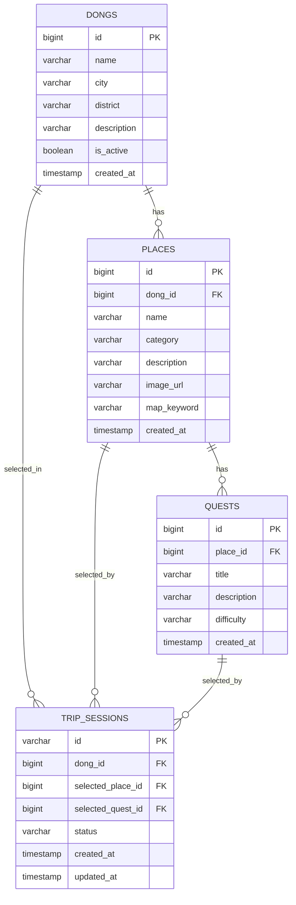

# 핀트립 MVP ERD (동·장소·퀘스트·세션)

이 문서는 `src/main/resources/db/schema.sql`을 기준으로 정리한 ERD다.  
DDL·목데이터 상세는 `src/main/resources/db/README.md`를 본다.

---

## 1. ERD (Mermaid)

---

## 2. 테이블별 설계 포인트

### `dongs`

- 프론트에 제공되는 동 목록(mock 10개)
- 프론트가 랜덤 UI로 돌린 뒤 **최종 동 1개**를 서버에 전달하면 세션 생성
- `is_active`로 목데이터 노출 on/off 제어

### `places`

- 동(`dong_id`)당 place 3개 (총 30개 mock)
- `image_url`: 장소 대표 이미지 1장 (스토리지 미정, mock URL 사용)
- `map_keyword`: 외부 지도 검색 링크 생성용

### `quests`

- mock 20개
- `place_id` FK로 특정 place에 연결
- 장소 랜덤 이후, 해당 place(또는 동 소속 place) 기준으로 퀘스트 랜덤

### `trip_sessions`

- 로그인 대체 식별자: `id`(UUID 문자열)
- **세션 생성 시점에 `dong_id` 필수** (별도 지역 PATCH 없음)
- `selected_place_id`, `selected_quest_id`는 랜덤 API 호출 후 저장
- `status`: `ACTIVE` / `COMPLETED` / `CANCELLED`

---

## 3. DDL 위치

실제 DDL은 아래 파일을 단일 소스로 사용한다.

- `src/main/resources/db/schema.sql`
- `src/main/resources/db/data.sql`

---

## 4. API와 ERD 매핑

| API | DB 동작 |
|-----|---------|
| `GET /dongs` | `dongs` 조회 (`is_active = true`) |
| `POST /trip-sessions` | `trip_sessions` insert (`id`, `dong_id`) |
| `POST /trip-sessions/{sessionId}/place/random` | `places`에서 `dong_id` 기준 랜덤 → `selected_place_id` update |
| `POST /trip-sessions/{sessionId}/quest/random` | `quests`에서 `place_id` 기준 랜덤 → `selected_quest_id` update |
| `GET /trip-sessions/{sessionId}` | `trip_sessions` + `dongs` + `places` + `quests` 조회 |

---

## 5. 목데이터 규모 (고정)

| 테이블 | 건수 |
|--------|------|
| `dongs` | 10 |
| `places` | 30 (동당 3) |
| `quests` | 20 |

---

## 6. P1 확장 후보 (현재 스키마 제외)

- `trip_logs` (여행 기록)
- `reroll_count`, 다시 뽑기 제한
- 이미지 실제 스토리지(S3/로컬) 연동
